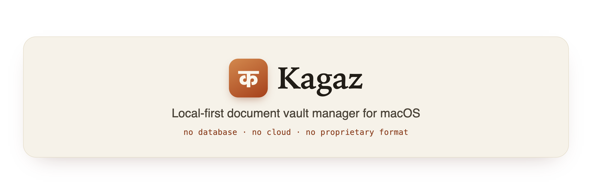

<p align="center">
  
</p>

# Kagaz

Kagaz (काग़ज़, "paper") is a local-first, global document vault manager for
macOS. Your documents stay exactly what they already are — ordinary files
in ordinary folders — and Kagaz adds naming convention, Finder tags and
searchable, offline facts on top. There is no database, no cloud sync of its
own, and no proprietary file format standing between you and your files.

> **Status: pre-1.0.** The CLI is released and installable — `brew install`
> below works today. The menu-bar app is a separate paid product and is not
> released yet; it needs code signing and notarization first. See
> [docs/HOMEBREW_CORE.md](docs/HOMEBREW_CORE.md) for exactly what is and
> isn't done.

## What Kagaz is

- A CLI (`kagaz`) that ingests documents, classifies them, files them under
  a consistent naming and folder convention, tags them in Finder, and keeps
  a searchable, offline index built from the files themselves.
- Convention-enforcing: one filename grammar, one folder layout, one tag
  vocabulary — all defined by a single `vault.yaml`, never hardcoded.
- Agent-legible on purpose: every command supports `--json`, there's an MCP
  server (`kagaz mcp`), and a vault's own `AGENTS.md` (regenerated by
  `kagaz index`) teaches an AI agent exactly how this vault is organized.
- Local-first: classification and OCR run on-device; the only thing that
  ever touches the network is an explicit `kagaz model pull`.
- Reads Office documents without Microsoft Office. Modern `.docx`/`.xlsx`/`.pptx`
  are parsed in-process (no external tool, always available); the legacy
  binary `.xls`/`.ppt` are also parsed in-process, and `.doc`/`.rtf`/`.rtfd`/`.odt`/`.wordml`
  go through macOS's built-in `/usr/bin/textutil` (so that slice is macOS-only).
  See [docs/architecture.md](docs/architecture.md#packages) for the tier
  breakdown and its limits.

## What Kagaz is not

- **Not a document store.** Your files stay as regular files on disk (or in
  iCloud Drive, if that's where you keep `~/Documents`). Delete Kagaz and
  every document is still exactly where the filesystem shows it.
- **Not a cloud service.** There is no Kagaz account and no backend:
  nothing you file, search, or store is ever sent anywhere, at any tier
  including paid ones. Sync is whatever you already use for the folder your
  vault lives in — iCloud Drive, Dropbox, or nothing at all.
- **Not a general file manager.** It only understands documents that fit
  its doctype catalog and convention; everything else in your filesystem is
  untouched and out of scope.
- **Not an OCR or LLM product in its own right.** OCR and classification
  are means to an end (correct filing), tiered so the tool is useful with
  zero model downloads and gets better, not different, as you opt into more.

## Requirements

**Apple silicon (M1 or later) and macOS 15 (Sequoia) or later.** Intel Macs
are not supported, on purpose — see the FAQ below.

## Install

```
brew tap getkagaz/kagaz
brew install kagaz
```

That installs the `kagaz` CLI, the `kagaz-mcp` server and `kagaz-machelper`
(Apple Vision OCR and on-device classification) from a prebuilt arm64 bottle.
The MLX classifier is a separate, opt-in formula — `brew install
getkagaz/kagaz/kagaz-mlx` — because it pulls the whole MLX-Swift stack and its
weights are a multi-gigabyte `kagaz model pull`.

Note `Formula/kagaz.rb` **in this repository** is not installable directly: its
`url` and `sha256` are placeholders the release workflow rewrites at tag time.
Install from the tap, not from a checkout.

See [docs/installation.md](docs/installation.md) for the full breakdown and the
optional MLX tier.

### From source

Needs **Go 1.23+** and **Xcode's Command Line Tools** (`xcode-select
--install`); full Xcode is *not* required for the base install. `poppler`
(`brew install poppler`) is optional and adds the fast `pdftotext` tier.

```
git clone https://github.com/getkagaz/kagaz.git
cd kagaz

go build -o bin/kagaz ./cmd/kagaz            # the CLI
go build -o bin/kagaz-mcp ./cmd/kagaz-mcp    # the MCP server

# Optional: the Swift helper (Apple Vision OCR + on-device classification).
swift build --package-path machelper -c release

# Put them on your PATH, e.g.
cp bin/kagaz bin/kagaz-mcp machelper/.build/release/kagaz-machelper /usr/local/bin/
```

Then `kagaz doctor` reports which optional tiers it can see.

## Quickstart

```
kagaz init --demo          # a populated, explorable vault
kagaz find --doctype invoice
kagaz find "acme"
kagaz lint
```

Or start from an empty vault of your own:

```
kagaz init                                   # writes ~/Documents/vault.yaml
kagaz ingest ~/Downloads/some-invoice.pdf     # propose, review, approve
kagaz find --person "you" --period FY2026
```

Every mutating command previews before it touches anything — see
[docs/architecture.md](docs/architecture.md#propose--preview--approve--execute-with-manifest).

## Commands

| Command | Does |
|---|---|
| `kagaz init` | Create a new vault (`--fy-start`, `--root`, `--demo`). |
| `kagaz find` | Query the vault by person, company, area, doctype, tag, period, or free text. |
| `kagaz ingest` | OCR → classify → propose → (on approval) file a document. |
| `kagaz move` | Relocate a document to its conventional path. |
| `kagaz tag` | Add/remove Finder tags, validated against the vault's vocabulary. |
| `kagaz supersede` | Mark a document replaced by a newer one. |
| `kagaz lint` | Report (and optionally `--fix`) convention violations. |
| `kagaz index` | Regenerate `INDEX.md` and `AGENTS.md`. |
| `kagaz rollback` | Reverse any manifest a mutating command produced. |
| `kagaz resolve` | Resolve a document reference to its current path (`--for-send` gates confidential documents). |
| `kagaz log` | Tail the audit log. |
| `kagaz model pull` | Download MLX classifier weights (the only network call in Kagaz). |
| `kagaz doctor` | Check vault health and which optional tools are available. |
| `kagaz watch` | Watch the vault and keep ingest proposals current, without auto-executing. |
| `kagaz mcp` | Run the stdio MCP server. |
| `kagaz completion` | Shell completion scripts. |

Full reference: [docs/commands.md](docs/commands.md).

## Privacy invariants

- **Nothing leaves your machine** except an explicit, opt-in
  `kagaz model pull`. Classification and OCR run on-device or against a
  localhost-only endpoint that Kagaz verifies at call time, not just from
  config.
- **Your documents are never deleted.** A "move" copies, SHA256-verifies,
  and retires the source into a staging folder inside the vault that only
  you empty.
- **Every mutation is reversible** via `kagaz rollback`, and nothing mutates
  without a preview and an explicit approval first.
- **Secrets never leave the Keychain.** This is the design rule for
  password-protected documents: no password would ever appear in a
  filename, sidecar, `INDEX.md`, manifest, or log — only a Keychain item
  name. **Not implemented yet.** Kagaz does not currently handle encrypted
  documents at all; `encrypted_docs.password_store` is accepted in
  `vault.yaml` and does nothing today.
- **Sending a confidential document out of the vault always requires
  explicit confirmation and always writes an audit line** — there is no
  flag or JSON mode that bypasses either.

Details: [docs/architecture.md](docs/architecture.md).

## FAQ

**Why does Kagaz require Apple silicon? Why not support Intel Macs?**

Both of Kagaz's semantic classifier tiers are Apple-silicon-only. Apple
Vision's accurate-mode OCR and Apple Foundation Models' on-device guided
generation are both `arm64` frameworks; Apple Foundation Models further
requires macOS 26, and macOS 26 is the last version of macOS that will run
on Intel hardware at all. Rather than ship an Intel build that runs a
permanently degraded, rules-only mode forever with no path to feature
parity, Kagaz declares Apple silicon a hard requirement from the start.
This was a considered decision, not an oversight; the constraint is stated
in [docs/architecture.md](docs/architecture.md) and enforced by
`Formula/kagaz.rb`'s `depends_on arch: :arm64` and `depends_on macos:
:sequoia`.

**Do I need to run a local LLM to use Kagaz?**

No. The offline rules-based classifier (keyword and pattern matching against
the doctype catalog) is always available and is what most of Kagaz's own
tests run against. Apple's on-device tiers add no download at all. MLX and
Ollama are opt-in for people who want them.

**Does Kagaz read my documents' contents and send them anywhere?**

No — see Privacy invariants above.

**Does building Kagaz need Xcode?**

The base `kagaz` build: no. Building it — from source directly, or from
`kagaz.rb` once Homebrew installs work — needs Xcode's
Command Line Tools and Go — full Xcode is not required, and
`Formula/kagaz.rb` declares no `depends_on xcode: :build`. The Apple
Foundation Models classifier's guided generation is built at run time with
`DynamicGenerationSchema` rather than the `@Generable` macro, because the
doctype catalog it's constrained to is only known at run time — every vault
can extend it via `vault.yaml` — and a macro's schema is fixed at compile
time, so `@Generable` was never usable here regardless of toolchain. The
`@Generable` macro plugin was the one thing that would have needed full
Xcode; `machelper` doesn't use it.

**`kagaz-mlx` (the separate, opt-in MLX tier) is the opposite: it genuinely
needs full Xcode**, and not for the reason you'd guess. MLX does compile
bundled C++ sources that need a complete C++ toolchain (Command Line Tools
usually has this; check with the command in
[docs/installation.md](docs/installation.md)) — but even with that
satisfied, `swift build` alone links a `kagaz-machelper-mlx` binary that
cannot run a single MLX operation, because SwiftPM has no build rule for
`.metal` shader sources at all. Producing the Metal shader library needs
`xcrun metal`, which ships only with full Xcode — there is no Command Line
Tools path around this one. See
[docs/installation.md](docs/installation.md) for the full build sequence.

**Is there a menu-bar app?**

Yes — **Kagaz for Mac**, a SwiftUI `MenuBarExtra` that holds zero vault logic
of its own and shells out to the `kagaz` CLI with `--json`, the same as
anything else that talks to a vault.

**It is a paid, closed-source product, and its source is not in this
repository.** This repository is the CLI: MIT-licensed, free, and complete on
its own — every command documented here works without the app, and nothing in
the CLI is withheld or degraded to sell it. The app is convenience over that
CLI, not a gate in front of it.

It is not yet released: signing, notarization and distribution all need an
Apple Developer account. See [docs/HOMEBREW_CORE.md](docs/HOMEBREW_CORE.md).

## Contributing

Contributions are welcome — see [CONTRIBUTING.md](CONTRIBUTING.md) for the
build/test/lint loop, the package layout, how to add a document type, and
review expectations. Please also read
[CODE_OF_CONDUCT.md](CODE_OF_CONDUCT.md). Found a security issue? See
[SECURITY.md](SECURITY.md) — please don't file it as a public issue.

## License

MIT — see [LICENSE](LICENSE). Copyright (c) 2026 RELYWEB TECHNOLOGIES PRIVATE
LIMITED.

Kagaz is **open core**: this repository — the `kagaz` CLI, the MCP server and
the `machelper` binaries — is MIT-licensed and free, and stays that way. A
separate paid, closed-source macOS app is built on top of it (see the FAQ
above); its source is not in this repository. Nothing documented here is
withheld or degraded to sell that app.
